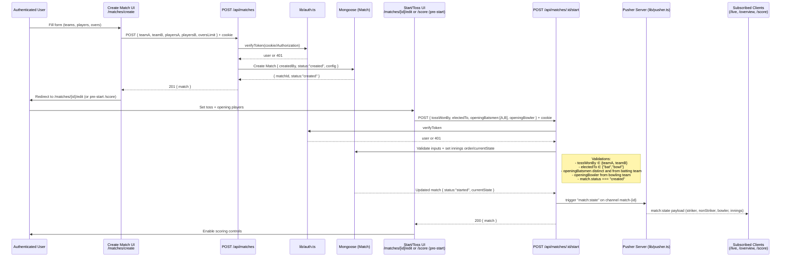

# Local League Cricket — Project Documentation

Version: 1.0  
Status: Beta  
Audience: Developers, QA, Operators

## 1. Overview
- Project name: Local League Cricket
- Summary: Web app to organize local cricket matches with authentication, match creation, live scoring, real-time updates via Pusher, and leaderboards backed by MongoDB.
- Primary use cases: Create/join matches, live scoring, viewing live matches and scorecards, aggregated leaderboards.
- Non-goals: Payments, complex tournaments, streaming media, DRS/umpire reviews.

## 2. Tech Stack
- Language: TypeScript (Next.js App Router, React 18)
- Runtime/Frameworks: Next.js 14, TailwindCSS, Pusher (server + client)
- Database: MongoDB via Mongoose
- Auth: JWT (HttpOnly cookie or Bearer)
- Email/Uploads (future-ready): Resend, UploadThing
- Tooling: ESLint, TypeScript, PostCSS, Tailwind
- Packaging: npm

## 3. Project Structure
```
test_project/
  app/
    (auth)/
      login/page.tsx
      register/page.tsx
    api/
      auth/login/route.ts
      auth/logout/route.ts
      auth/me/route.ts
      auth/register/route.ts
      health/route.ts
      leaderboard/route.ts
      matches/route.ts
      matches/[id]/route.ts
      matches/[id]/debug/route.ts
      matches/[id]/score/route.ts
      matches/[id]/start/route.ts
      test/route.ts
    dashboard/page.tsx
    globals.css
    home/layout.tsx
    home/page.tsx
    layout.tsx
    leaderboard/page.tsx
    matches/[id]/page.tsx
    matches/[id]/edit/page.tsx
    matches/[id]/live/page.tsx
    matches/[id]/score/page.tsx
    matches/[id]/score/components/*.tsx
    matches/[id]/scorecard/page.tsx
    matches/create/page.tsx
    page.tsx
  components/
    animations/ScrollAnimation.tsx
    dashboard/*.tsx
    home/*.tsx
    Leaderboard/LeaderboardTabs.tsx
    Leaderboard/TeamsLeaderboard.tsx
    sections/*.tsx
    ui/*.tsx
  hooks/
    useAuth.ts
    useMatchScoring.ts
  lib/
    api-client.ts
    auth.ts
    db.ts
    pusher.ts
    pusher-client.ts
    utils.ts
  models/
    index.ts
    Match.ts
    User.ts
  types/
    index.ts
    match.ts
  utils/
    apiHelpers.ts
    debugLogger.ts
    scoringValidations.ts
  middleware.ts
  debug-db.js
  .env.local
  package.json
  tailwind.config.ts
  tsconfig.json
  next.config.js
  postcss.config.mjs
  eslint.config.mjs
  README.md
  product-specification.md
  (node_modules/, public/, scripts/ present)
```

## 4. Getting Started
- Prerequisites
  - Node.js 18+
  - MongoDB running locally (default URI: mongodb://localhost:27017/local-league-cricket)
- Setup (Windows PowerShell)
  - Create venv not required (Node project)
  - Install deps: npm install
  - Copy environment: ensure .env.local exists with valid values (do not commit secrets)
- Run dev server
  - Start MongoDB (if Windows service): net start MongoDB
  - Or run via Docker (optional): docker run -d -p 27017:27017 --name mongo mongo:6
  - Start app: npm run dev
  - Open http://localhost:3000

## 5. How to Run
- Development: npm run dev
- Production build: npm run build; npm start
- Lint: npm run lint
- DB connectivity test: node .\debug-db.js

## 6. Configuration
- Source: .env.local (not committed)
- Keys
  - MONGODB_URI: Mongo connection string
  - JWT_SECRET, JWT_EXPIRE: JWT signing secret and expiry
  - Pusher: PUSHER_APP_ID, PUSHER_SECRET (server), NEXT_PUBLIC_PUSHER_KEY, NEXT_PUBLIC_PUSHER_CLUSTER
  - RESEND_API_KEY (future email)
  - UPLOADTHING_SECRET, UPLOADTHING_APP_ID (future uploads)
  - NEXT_PUBLIC_APP_URL, NODE_ENV
- Precedence: process.env with Next.js runtime; client-side only sees NEXT_PUBLIC_* variables.

## 7. Components and Modules

This section lists each module/component with purpose, what it does, doesn’t do, and how it works.

7.1 lib/
- api-client.ts
  - Purpose: Small fetch wrapper for calling app/api endpoints from the client.
  - Does: Adds base URL, JSON headers, auth cookie by default, parses JSON, throws on non-2xx.
  - Doesn’t: Store tokens itself; no retry/backoff; no schema validation.
  - How: window.fetch or fetch with options; merges method/body; returns typed data.

- auth.ts
  - Purpose: Server-side auth helpers (JWT sign/verify, password hashing/compare, cookie helpers).
  - Does: Creates/verifies JWT with JWT_SECRET; hashes passwords via bcryptjs; reads/writes HttpOnly cookie.
  - Doesn’t: Rate-limit; handle OAuth; refresh tokens.
  - How: jose/jsonwebtoken + bcryptjs; exported functions like signToken, verifyToken, hashPassword, comparePassword, getUserFromRequest.

- db.ts
  - Purpose: Mongoose connection manager (singleton).
  - Does: Connects once per process to MONGODB_URI; reuses connection across API handlers.
  - Doesn’t: Run migrations; seed data.
  - How: Mongoose.connect with cached connection in globalThis to avoid hot-reload leaks.

- pusher.ts
  - Purpose: Server Pusher client for publishing events.
  - Does: Triggers events to match channels; hides server credentials.
  - Doesn’t: Subscribe; client-side listening.
  - How: pusher (server SDK) instantiated with PUSHER_APP_ID/SECRET/KEY/CLUSTER.

- pusher-client.ts
  - Purpose: Client-side Pusher instance to subscribe to channels.
  - Does: Subscribes to match-{id}; binds event listeners for score updates/state.
  - Doesn’t: Publish events; store app state.
  - How: pusher-js with NEXT_PUBLIC_PUSHER_KEY/CLUSTER.

- utils.ts
  - Purpose: Shared runtime utilities (e.g., safe JSON, string/date helpers).
  - Does: Pure helpers used by various modules.
  - Doesn’t: Side-effects or I/O.
  - How: Small, focused functions.

7.2 hooks/
- useAuth.ts
  - Purpose: Client auth state hook.
  - Does: Fetches /api/auth/me; exposes user, loading, login(), logout(), register().
  - Doesn’t: Persist tokens manually (cookie managed by server); role-based checks beyond basic user presence.
  - How: React state/effects; uses lib/api-client or utils/apiHelpers.

- useMatchScoring.ts
  - Purpose: Client state for in-progress scoring UI.
  - Does: Holds striker/non-striker/bowler, over state, pending ball event; validates before submit; listens to Pusher updates.
  - Doesn’t: Persist to DB itself; override server truth.
  - How: React reducer/state; uses utils/scoringValidations and lib/pusher-client; posts to /api/matches/[id]/score.

7.3 models/
- User.ts
  - Purpose: Mongoose User schema/model.
  - Does: email (unique), passwordHash, name, roles, createdAt.
  - Doesn’t: Store plaintext password; OAuth identities.
  - How: Mongoose schema with indexes; pre-save or helper for hashing (handled in auth flow).

- Match.ts
  - Purpose: Mongoose Match schema/model representing teams, players, innings, events, and current state.
  - Does: Tracks toss, overs, batsmen, bowler, extras, wickets; stores ball-by-ball events; status (created/started/finished).
  - Doesn’t: Enforce all rules at DB layer; historical stats aggregation.
  - How: Nested subdocs for innings/overs/batting/bowling; static methods for queries.

- index.ts
  - Purpose: Central model export and singleton pattern for model reuse in hot reload.
  - Does: Exports getModel-or-create guard: mongoose.models['User'] || mongoose.model('User', schema).
  - Doesn’t: Connect; that’s lib/db.

7.4 types/
- match.ts
  - Purpose: TS interfaces/types for match domain (Match, Innings, Over, BallEvent, Player).
  - Does: Ensures typed contracts across UI/API.
  - Doesn’t: Runtime validation.
- index.ts
  - Purpose: Re-exports common types; shared DTOs (e.g., AuthUser).

7.5 utils/
- apiHelpers.ts
  - Purpose: Thin convenience wrappers around fetch with JSON handling.
  - Does: get/post/put/delete with typed generics; error normalization.
  - Doesn’t: Advanced retries; caching.
  - How: Response.ok guard, JSON.parse.

- debugLogger.ts
  - Purpose: Conditional logging helper for dev.
  - Does: Namespaced logs, toggle by NODE_ENV or custom flag.
  - Doesn’t: Structured logging/telemetry.
  - How: console.log with prefixes; no-op in production.

- scoringValidations.ts
  - Purpose: Cricket rules: ball legality, strike rotation, over completion, extras handling, constraints.
  - Does: Validate input events; compute next striker/bowler; determine when over/innings complete.
  - Doesn’t: Persist; UI rendering.
  - How: Pure functions that accept current state and event and return next state + validation errors.

7.6 app/ (pages and API route handlers)

UI Routes (App Router)
- app/layout.tsx, app/globals.css
  - Purpose: Root layout and global styles.
  - Does: Theme, fonts, metadata; wraps all pages.

- app/page.tsx (Home marketing or redirect)
- app/home/layout.tsx, app/home/page.tsx
  - Purpose: Home experience (marketing + quick actions).
  - Does: Renders sections/CallToAction/Features/HowItWorks etc.

- app/(auth)/login/page.tsx
  - Purpose: Login form.
  - Does: POST /api/auth/login; sets cookie; redirects on success.
  - Doesn’t: Handle social providers.

- app/(auth)/register/page.tsx
  - Purpose: Registration form.
  - Does: POST /api/auth/register; then login.

- app/dashboard/page.tsx
  - Purpose: Authenticated dashboard.
  - Does: Lists “My Matches”, “Invited Matches”, quick actions; uses components/dashboard/*.

- app/leaderboard/page.tsx
  - Purpose: Aggregated leaderboards.
  - Does: Calls /api/leaderboard; renders LeaderboardTabs/TeamsLeaderboard.

- app/matches/create/page.tsx
  - Purpose: Create match flow.
  - Does: Form for teams, players, overs; POST /api/matches.

- app/matches/[id]/page.tsx
  - Purpose: Match overview page.
  - Does: Summary, live indicator, links to Score, Live, Scorecard.

- app/matches/[id]/edit/page.tsx
  - Purpose: Edit match details before start.
  - Does: Update pre-start fields.

- app/matches/[id]/live/page.tsx
  - Purpose: Spectator live view.
  - Does: Subscribes to Pusher channel; renders updates.

- app/matches/[id]/score/page.tsx
  - Purpose: Scorer interface.
  - Does: Orchestrates scoring subcomponents in components/matches/[id]/score/components/*.

- app/matches/[id]/score/components/*
  - BatsmanSelection.tsx: Select striker and non-striker.
  - BatsmanSelectionForm.tsx: Controlled form for batsman pick; validates duplicate selection.
  - BowlerSelection.tsx: Pick/change current bowler with over constraints.
  - CurrentOver.tsx: Shows balls in current over with outcomes.
  - CurrentPlayers.tsx: Shows current striker/non-striker/bowler and their stats.
  - ExtrasModal.tsx: Capture NB/W/Bye/LB values.
  - PlayerSelection.tsx: General list of available players by team/role.
  - PlayerSelectionForm.tsx: Form wrapper for selection flows.
  - ScoreDisplay.tsx: Total, wickets, overs, run rate.
  - ScoringControls.tsx: Buttons/inputs to record ball outcomes.
  - ScoringInterface.tsx: Composes controls + display; integrates useMatchScoring.
  - TossForm.tsx: Set toss winner and decision.
  - TossSection.tsx: Pre-start toss setup.
  - Does: Render-only + client-state; submit to /api/matches/[id]/score or /start.
  - Doesn’t: Bypass server validations; write to DB directly.
  - How: Controlled components; toasts for feedback; Pusher for updates.

- app/matches/[id]/scorecard/page.tsx
  - Purpose: Finalized scorecard.
  - Does: Pulls match by id; renders innings breakdown.

API Routes (Route Handlers under app/api)
- app/api/health/route.ts
  - GET: { status: "ok" } for uptime checks.

- app/api/auth/register/route.ts
  - POST { email, password, name } → 201 { user } and/or sets cookie.
  - Validates unique email; hashes password; saves User; signs JWT.

- app/api/auth/login/route.ts
  - POST { email, password } → 200 { user } and sets cookie.
  - Compares hash; on success, signs JWT.

- app/api/auth/logout/route.ts
  - POST → 200; clears auth cookie.

- app/api/auth/me/route.ts
  - GET → 200 { user } using token from cookie or Authorization header.

- app/api/matches/route.ts
  - GET → { matches: [...] } with filters (optional).
  - POST → create match (teams, players, overs config) → 201 { match }.

- app/api/matches/[id]/route.ts
  - GET → { match } by id.

- app/api/matches/[id]/start/route.ts
  - POST { tossWonBy, electedTo, openingBatsmen, openingBowler } → 200 { match }.
  - Validates players/bowler membership and initial state.

- app/api/matches/[id]/score/route.ts
  - POST { ballEvent } → 200 { match, overUpdate }.
  - Validates via utils/scoringValidations; updates Match; pushes pusher events:
    - channel: match-{id}
    - events: score:update, match:state

- app/api/matches/[id]/debug/route.ts (dev only)
  - GET → state snapshot for debugging.

- app/api/leaderboard/route.ts
  - GET → { leaderboard: [...] } aggregated from Match data.

- app/api/test/route.ts
  - For internal testing.

7.7 components/ (shared UI)
- animations/ScrollAnimation.tsx
  - Purpose: Reveal/animate on scroll.
  - Does: Framer-motion or IntersectionObserver-based animation.
  - Doesn’t: Persist state.

- dashboard/
  - Footer.tsx: Dashboard footer.
  - InvitedMatches.tsx: List matches where user invited.
  - JoinMatchModel.tsx: Modal to join a match by code/invite.
  - MyMatches.tsx: List of user-owned/participating matches.
  - Navbar.tsx: Dashboard navigation bar.
  - QuickActions.tsx: Create match, join, go-to-live shortcuts.
  - WelcomeBanner.tsx: Greeting + tips.

- home/
  - Header.tsx: Site header/hero.
  - LiveMatches.tsx: Live matches carousel/list.
  - QuickActions.tsx: CTA tiles.
  - RecentActivity.tsx: Recently finished/created matches.
  - StatsOverview.tsx: App stats counters.
  - TeamPerformance.tsx: Sample team metrics.
  - UpcomingMatches.tsx: Scheduled matches.

- Leaderboard/
  - LeaderboardTabs.tsx: Tabs for Teams/Players/etc.
  - TeamsLeaderboard.tsx: Teams table.

- sections/
  - AdminUserAccess.tsx: Admin-only visibility controls.
  - CallToAction.tsx: CTA section.
  - Features.tsx: Feature list.
  - Footer.tsx: Landing page footer.
  - Hero.tsx: Landing hero section.
  - HowItWorks.tsx: Steps explanation.
  - LiveMatchPreview.tsx: Highlight current live match.
  - ScoreCard.tsx: Reusable scorecard block.

- ui/ (design system)
  - AlertDialog.tsx, badge.tsx, button.tsx, card.tsx, tabs.tsx, toaster.tsx
  - Purpose: Reusable primitives with Tailwind & Radix UI.
  - Does: Styling, accessibility, consistent UX.
  - Doesn’t: Business logic.

7.8 middleware.ts
- Purpose: Route guarding and redirects.
- Does: Allows public routes; protects /dashboard, /matches, /profile, /settings; redirects if not authenticated; redirects logged-in users away from /login and /register.
- Doesn’t: Validate JWT content; rate-limit.
- How: Reads cookie "auth-token" or Authorization header; NextResponse redirects.

7.9 debug-db.js
- Purpose: Quick connectivity test to local MongoDB (Node MongoDB driver).
- Does: Connects, lists collections, inserts a test user doc, deletes it.
- Doesn’t: Use Mongoose; affect app schemas.
- How: MongoClient; async script with try/finally.

## 8. Data Flow and Architecture
- Flow
  - UI (Next.js pages) → app/api route handlers → Mongoose models (MongoDB).
  - Realtime: Server route handler updates → lib/pusher triggers → clients subscribed via pusher-client receive events → UI updates local state.
- Layers
  - Presentation: app/* pages, components/*
  - Domain/State: hooks/* and utils/scoringValidations.ts
  - Persistence: models/* with lib/db.ts
  - Integration: lib/pusher*.ts, lib/auth.ts
- Source of truth: Server-side state in MongoDB.

## 9. API (Contracts Overview)
- Auth
  - POST /api/auth/register → 201 { user } (no password), sets cookie
  - POST /api/auth/login → 200 { user }, sets cookie
  - POST /api/auth/logout → 200 {} clears cookie
  - GET /api/auth/me → 200 { user }
- Health
  - GET /api/health → 200 { status: "ok" }
- Matches
  - GET /api/matches → 200 { matches: Match[] }
  - POST /api/matches → 201 { match: Match }
  - GET /api/matches/:id → 200 { match: Match }
  - POST /api/matches/:id/start → 200 { match: Match }
  - POST /api/matches/:id/score → 200 { match: Match, overUpdate }
  - GET /api/matches/:id/debug → 200 { state } (dev)
- Leaderboard
  - GET /api/leaderboard → 200 { leaderboard: any[] }
Notes: Exact shapes are defined in types/match.ts and the route handlers.


## 9) Match Creation and Start (Toss + Opening Players)



Validation rules (server-enforced)
- tossWonBy must be teamA or teamB.
- electedTo is "bat" or "bowl".
- openingBatsmen are two distinct players from the batting team.
- openingBowler is from the bowling team and not an opening batsman.
- Match must be in status "created"; otherwise 409 Conflict.
- Auth required; 401 if missing/invalid token. Optional: only creator/scorer role can start (403 on violation).

Error handling
- 400 Bad Request: malformed payload or invalid player IDs.
- 401 Unauthorized: no/invalid token.
- 403 Forbidden: user not allowed to start this match (if enforced).
- 409 Conflict: match already started/finished.
- 500 Server Error: unexpected failures (DB, logic).

State transitions
- created -> started -> finished
- Start action sets: toss, electedTo, innings order, currentState (striker, nonStriker, bowler, over=0.0), and publishes match:state via Pusher.


## 10. CLI (N/A)
- No dedicated CLI. Use npm scripts and API calls.

## 11. Background Jobs / Schedulers
- None. Realtime updates via Pusher; all writes synchronous within API handlers.

## 12. Database / Storage
- Engine: MongoDB
- Connection: MONGODB_URI via lib/db.ts (Mongoose)
- Collections
  - users: from models/User.ts
  - matches: from models/Match.ts
- Migrations: None (schema-on-read). Use cautious changes with defaults.
- Seed Data: None built-in (debug-db.js verifies connectivity only).

## 13. Error Handling
- API errors return JSON with message/code; HTTP codes:
  - 400 validation; 401 unauthorized; 403 forbidden; 404 not found; 409 conflict; 500 server.
- Client shows toast on errors; avoids blocking UI when possible.
- Retries: none built-in; rely on manual retry from the UI.

## 14. Logging and Monitoring
- Server: console logging per route handler (add identifiers for errors).
- Client: debugLogger.ts in dev; toast feedback for users.
- Monitoring: Not integrated. Add platform logs if deployed (e.g., Vercel).

## 15. Security
- JWT secrets loaded from env; stored server-side; HttpOnly cookie.
- Public env vars prefixed with NEXT_PUBLIC_; do not expose secrets to client.
- Middleware protects authenticated pages.
- Input validation in API handlers and scoringValidations.
- Rate limiting not implemented (recommended for auth endpoints).
- Avoid committing .env.local (gitignored). Rotate any leaked keys.

## 16. Testing
- Current: No test suite present.
- Recommended:
  - Unit: utils/scoringValidations.ts, lib/auth.ts
  - Integration: API route handlers under app/api/*
  - E2E: Scoring flow with a real Mongo test DB
- Suggested tooling: Jest or Vitest + React Testing Library + supertest
- Run: Add npm scripts like "test": "jest" (not yet configured)

## 17. Performance
- Target: <150ms server processing for scoring endpoint typical; realtime push ~500ms E2E.
- Hotspots: scoring calculations, match document updates, Pusher triggers.
- Tips: Use lean queries for reads; project only needed fields; index user email; consider match id indexes.

## 18. CI/CD
- Not included. Suggested:
  - Lint, typecheck, unit tests on PR.
  - Build check.
  - Environment-specific .env via secret manager.

## 19. Deployment
- Targets: Vercel or Node server
- Steps:
  - Set env vars on platform (never commit secrets).
  - Build: npm run build
  - Start: npm start (or platform auto-start)
  - Ensure MongoDB reachable (Atlas or managed instance).
- Realtime: Configure Pusher keys per environment.

## 20. Troubleshooting
- Cannot connect to MongoDB
  - Ensure service running: net start MongoDB (Windows) or Docker container.
  - Test: node .\debug-db.js
  - Verify MONGODB_URI in .env.local
- Auth always redirects to login
  - Check "auth-token" cookie is set after login.
  - Confirm JWT_SECRET matches between login and verification.
- Realtime not updating
  - Verify NEXT_PUBLIC_PUSHER_KEY/CLUSTER client-side and PUSHER_SECRET server-side.
  - Check channel name: match-{id}.
- 500 errors on scoring
  - Inspect server logs; validate ballEvent payload; run validations locally.

## 21. Known Limitations
- No undo-last-ball in MVP.
- No rate limiting.
- No role granularity beyond basic checks.
- No migrations/versioned schemas.
- Limited test coverage (none by default).

## 22. Non-Goals
- Payments, complex tournaments, media uploads/streaming, advanced analytics, DRS/umpire reviews.

## 23. Roadmap
- Near-term: Tests for scoringValidations; role-based scoring; basic rate limiting.
- Mid-term: Team/club management; player histories; offline scoring and sync; invites via email.

## 24. Glossary
- Over: 6 legal balls (wides/no-balls excluded from legal count).
- Extras: Runs not credited to batsman (W, NB, B, LB).
- Striker/Non-striker: Current batsmen; rotate per runs/over end.
- Pusher: Third-party realtime pub/sub service.

## 25. File-by-File Responsibility Matrix (Does / Does Not / How)

Short references for all files:
- app/globals.css
  - Does: Global Tailwind and theme styles.
  - Doesn’t: Component-level overrides.
  - How: Imported by root layout.

- app/layout.tsx
  - Does: Root shell, metadata, fonts.
  - Doesn’t: Page business logic.
  - How: Next.js App Router layout.

- app/page.tsx
  - Does: Landing or redirect to /home.
  - Doesn’t: Auth gating.

- app/(auth)/login/page.tsx, app/(auth)/register/page.tsx
  - Does: Forms to POST auth endpoints.
  - Doesn’t: Client-side password storage.

- app/api/** (all routes listed in 7.6)
  - Does: HTTP JSON APIs; server-side business logic.
  - Doesn’t: Render UI.

- app/dashboard/page.tsx
  - Does: Uses components/dashboard/* to show matches and actions.
  - Doesn’t: Write to DB directly (uses API).

- app/home/layout.tsx, app/home/page.tsx
  - Does: Marketing/screens composition.
  - Doesn’t: Protected content.

- app/leaderboard/page.tsx
  - Does: Render leaderboard UI from /api/leaderboard.

- app/matches/** pages
  - Does: Read/Write via /api/matches*; Pusher subscribe on live/score pages.
  - Doesn’t: Bypass server validations.

- components/** (all listed)
  - Does: UI composition; trigger API calls via hooks/helpers.
  - Doesn’t: Persist on their own.

- hooks/useAuth.ts, hooks/useMatchScoring.ts
  - Does: Client state orchestration.
  - Doesn’t: Store secrets.

- lib/** (auth, db, pusher, api-client, utils)
  - Does: Cross-cutting services and helpers.
  - Doesn’t: UI rendering.

- models/** (User, Match, index)
  - Does: DB schemas, typed models.
  - Doesn’t: Connect (handled by lib/db).

- types/** (index, match)
  - Does: Type contracts; shared DTOs.
  - Doesn’t: Runtime logic.

- utils/** (apiHelpers, debugLogger, scoringValidations)
  - Does: Pure helpers, validations, light wrappers.
  - Doesn’t: Side-effectful persistence.

- middleware.ts
  - Does: Protect routes and redirect unauthenticated users.
  - Doesn’t: Validate token contents deeply.

- debug-db.js
  - Does: Connectivity smoke test.
  - Doesn’t: Use Mongoose.

- README.md
  - Does: Next.js default getting-started.

- product-specification.md
  - Does: Product goals, scope, requirements (authoritative spec).

- tailwind.config.ts, postcss.config.mjs
  - Does: Styling/build config.

- tsconfig.json
  - Does: TypeScript compiler settings, path alias "@/*".

- next.config.js
  - Does: Next.js config; images domains.

- eslint.config.mjs
  - Does: ESLint config with Next core-web-vitals.

- .gitignore
  - Does: Ignores node_modules, .next, .env*, etc.

- .env.local
  - Does: Local environment values (never commit). Replace any placeholder secrets before running.

## 26. Security Note on Environment Variables
Do not publish or commit .env.local. Rotate any exposed keys immediately. In production, set secrets via platform secret managers.
